# GitHub Actions Manager

React + Vite application for exploring GitHub Actions workflows across repositories within a GitHub organization. This document tracks project rules, architecture decisions, and onboarding steps. Update it whenever new tooling or conventions are introduced.

## Live Deployment

- **GitHub Pages**: https://animated-adventure-jz58983.pages.github.io/

## Stack Overview

- **Framework**: React 19 with TypeScript 5.9 (`src/` compiled by Vite 7).
- **Styling**: Tailwind CSS 3.4 with CSS variables, `tailwindcss-animate`, and shadcn/ui New York theme.
- **UI Components**: shadcn/ui via CLI (`components.json`), Radix UI primitives (`@radix-ui/react-*`), Lucide icons (`lucide-react`), `class-variance-authority`, `clsx`, and `tailwind-merge` utilities.
- **Data & GitHub integrations**: TanStack Query orchestrating GitHub REST calls, custom API client in `src/lib/github/client.ts`, `js-yaml` for parsing workflow files, and helper modules under `src/lib/github/`.
- **Tooling**: ESLint 9 (flat config in `eslint.config.js`), PostCSS, Vite dev server & build pipeline.

### Core Runtime Dependencies

| Package                                          | Version            | Notes                                                                   |
| ------------------------------------------------ | ------------------ | ----------------------------------------------------------------------- |
| react / react-dom                                | ^19.1.1            | Concurrent features available; keep hooks pure.                         |
| @tanstack/react-query                            | ^5.90.5            | Centralized query client; follow stale-time patterns defined in hooks.  |
| @radix-ui/react-\*                               | ^1.x-^2.x          | Used for accessible primitives; do not wrap with non-semantic elements. |
| lucide-react                                     | ^0.546.0           | Icon glyphs.                                                            |
| tailwindcss / tailwindcss-animate                | ^3.4.x / ^1.0.7    | Utility-first styling, animation helpers.                               |
| class-variance-authority / clsx / tailwind-merge | ^0.7 / ^2.1 / ^3.3 | Class composition & dedupe.                                             |
| js-yaml                                          | ^4.1.0             | Parse workflow YAML when dispatching runs.                              |

### Tooling & Developer Dependencies

| Package                              | Version             | Notes                                                    |
| ------------------------------------ | ------------------- | -------------------------------------------------------- |
| vite                                 | ^7.1.7              | Dev server & bundler.                                    |
| @vitejs/plugin-react                 | ^5.0.4              | SWC-based transform.                                     |
| typescript                           | ~5.9.3              | Keep `tsconfig.app.json` consistent with Vite, React 19. |
| eslint / @eslint/js                  | ^9.36.0             | Flat config; run `npm run lint`.                         |
| typescript-eslint                    | ^8.45.0             | Coordinates ESLint with TS 5.9.                          |
| @types/react / @types/react-dom      | ^19.1.x             | Ambient types for new JSX runtime.                       |
| tailwindcss / postcss / autoprefixer | ^3.4 / ^8.5 / ^10.4 | Build pipeline.                                          |
| shadcn                               | ^3.4.2              | CLI for generating design system components.             |

> **Upgrades:** When bumping any dependency, update this table and capture breaking changes or migration steps in the "Maintenance Notes" section.

## Getting Started

- **Install dependencies**: `npm install`
- **Run locally**: `npm run dev`
- **Lint**: `npm run lint`
- **Preview production build**: `npm run preview` (after `npm run build`)

The app boots from `src/main.tsx`, renders `App.tsx`, and styles load from `src/index.css` (Tailwind entry point).

## Using the Application

1. **Authenticate with GitHub**
   - Open the _Access Token_ dialog from the header to provide a personal access token (PAT).
   - Only the presence of a token is stored in React state; the raw token persists in `localStorage` and is never shown in the UI.
   - Clearing the token invalidates cached GitHub queries so the UI stays consistent across tabs.

2. **Choose monitoring scope**
   - The _Organization & Repository Selector_ loads organizations tied to the PAT and lists repositories for the selected organization.
   - Repositories persist in `localStorage`, and you can enable/disable entries, filter by name, reorder the list, or reset the scope entirely.

3. **Explore workflow health**

- The _Repository Workflow Dashboard_ fetches workflows for each monitored repository and summarizes their most recent runs.
- Filter runs by branch, date range, or run title, and hide workflows without recent activity to focus on active pipelines.
- Open the _Workflow Details_ dialog for per-run metadata, timestamps, and quick links back to GitHub.

4. **Track deployments across environments**

- Switch the dashboard view to **Deployments** to open the _Repository Deployment Grid_. Each repository renders a column per detected GitHub environment with the latest non-`inactive` deployment status highlighted in the cell color.
- Cells show a quick status label, updated timestamp, initiating actor, and truncated commit message (hover to view the full value). The “History” link opens the GitHub deployment history for the repository/environment pair.
- Use **Customize columns** to hide or reorder environments. Preferences persist to `localStorage` per-organization, and controls stay responsive even after reordering. Click **Reset** to restore defaults.

5. **Run bulk automation**

- **Bulk Branch Dialog**: create a new branch across all selected repositories from a shared base ref.
- **Bulk PR Dialog**: open matching pull requests across repositories with a shared title, description, and source/target branches.
- **Bulk PR Review Dialog**: approve, request changes, or comment on multiple pull requests selected in the **Pull Requests** dashboard view. The footer bulk-action selector exposes the review workflow, validates required comments for feedback/rejections, and tracks per-repository submission progress with success and error states.
- **Bulk Workflow Run Dialog**: dispatch multiple workflow runs in parallel across selected repositories.
  - **Multi-select workflows**: Choose one or more workflows from all available workflows across selected repositories. Workflows are displayed in the format "{repository} - {workflow name}" and you can select multiple workflows to run simultaneously (no longer limited to workflows common to all repositories).
  - **Aggregated input handling**: Automatically combines inputs from all selected workflows, showing which workflows require each input and allowing you to provide values that apply to all relevant workflows.
  - **Input caching**: Avoids redundant API calls when switching between workflow selections and rehydrates inputs from previous runs to minimise typing.
  - **Per-workflow payload filtering**: Dispatch requests only include inputs that the target workflow file supports, preventing 422 errors from unexpected parameters.
  - **Enhanced progress tracking**: Shows repository and workflow name for each dispatch operation with real-time status updates and links back to the created runs.
  - **Dialog layout parity**: Dialog height is constrained to 80% of the viewport with a scrollable body, aligning with the other bulk dialogs for consistent ergonomics.
- **Bulk File Edit Dialog**: Search and edit files across multiple repositories using glob patterns or regex.
  - **Glob pattern search**: Find files matching glob patterns (e.g., `**/*.yml`, `src/**/*.ts`) across selected repositories.
  - **Regex search & replace**: Use regular expressions to find and replace content in files with full match preview and capture group support.
  - **Regex presets**: Built-in presets for common patterns (Node.js version, Python version, package versions, GitHub Actions versions) with custom regex support.
  - **Branch & PR creation**: Automatically create a new branch with changes and optionally create a pull request.
  - **Per-file preview**: View matching content before applying changes with syntax highlighting.
- Each action surfaces repository-level progress, success/error statuses, and direct links to resulting GitHub resources.

6. **Bulk Branch View**

- We can delete branches across all selected repositories using the **Bulk Branch View**.

7. **Review pull requests before merging**

- The **Pull Requests** dashboard view surfaces repository PRs with mergeability context derived from GitHub.
- **Mergeable status badges**: Each PR entry now indicates whether it is mergeable, has conflicts, is blocked, or has failing checks. Unknown states render a neutral badge while GitHub computes mergeability.
- **Auto refresh controls**: Use the toolbar toggle to enable 60-second auto refreshes for the active dashboard view; disable it to remain on-demand.

8. **Organize repositories with groups**

- Use the **Repository Groups Manager** to organize repositories into named groups for easier management.
- **Create and manage groups**: Create named groups, add/remove repositories, enable/disable groups, and delete groups.
- **Import/Export**: Export groups to JSON for backup or sharing, import groups from JSON files.
- **Persistent storage**: Groups are saved to localStorage and persist across sessions.
- **Per-organization**: Groups are scoped to each organization, so switching organizations shows the appropriate groups.

9. **Search for stale branches**

- Use the **Stale Branch Search** dialog to find branches that have been merged and can be cleaned up.
- **Detection method**: Uses GitHub Compare API to check if a branch is ahead/behind the base branch.
- **Filter options**: Filter by user (specific user or ALL users) and by age (older than X days from last commit).
- **Rate limiting**: API calls are serialized with delays to prevent GitHub API rate limits.
- **Progress tracking**: Shows real-time progress during the search with repository-level status.
- **Bulk actions**: Found stale branches are auto-selected for bulk deletion.

> **Maintenance reminder:** Update this usage section whenever features are added, modified, or removed.

## Project Structure

- **`src/components/ui/`**: shadcn/ui primitives (e.g., `button.tsx`). Always generate via CLI to keep tokens in sync.
- **`src/components/`**: feature components composed from the UI library. Highlights:
  - `repository-workflow-dashboard.tsx`: orchestrates view mode, filters, and delegates rendering to the appropriate dashboard view.
  - `repository-dashboard-repository-view.tsx`: owns workflows/deployments/branches selection, bulk dialogs, and workflow details while rendering shared content via `repository-dashboard-view-content.tsx`.
  - `repository-dashboard-pull-request-view.tsx`: encapsulates pull request selection, bulk merge/review dialogs, and query invalidation.
  - `repository-dashboard-toolbar.tsx`: surface view switching and auto-refresh toggle logic.
  - `repository-pull-request-tree.tsx` / `repository-deployment-grid.tsx`: domain-specific trees and grids used inside the views.
  - `bulk-*-dialog.tsx`: modal workflows for branch creation/deletion, PR merge/review, and workflow dispatch.
- **`src/lib/`**: shared utilities such as `utils.ts` (`cn()` helper) and GitHub client helpers.
- **`src/hooks/`**: application hooks (e.g., `useGithubAccessToken`, `useRepositorySelection`, `useWorkflowDashboardData`).
- **`components.json`**: shadcn/ui CLI configuration (style, aliases, registry).
- **`tailwind.config.ts`**: Tailwind theme tokens, container defaults, animation primitives.
- **`tsconfig.app.json` & `tsconfig.json`**: TypeScript compiler options and the `@/*` path alias.
- **`public/`**: static assets served as-is.

## Architecture & Conventions

- **Component-driven**: Keep layout primitives (e.g., `App.tsx`) thin. Build reusable pieces in `src/components`. Keep UI-only logic inside `ui/` components; business logic lives in feature modules under `src/features/` when they are introduced.
- **Imports**: Use the `@/*` alias instead of relative paths (`@/components/ui/button`). Configure new tsconfig references if additional packages require type-aware linting.
- **Styling**: Follow the CSS variables defined in `src/index.css`. Apply theme tokens using Tailwind utility classes. Prefer `cn()` helper for conditional class composition.
- **State & Data**: TanStack Query (React Query) is the standard data layer—use `QueryClientProvider` (configured in `src/main.tsx`) and colocated hooks for GitHub interactions. `src/hooks/githubQueries.ts` centralizes query hooks and reusable fetch helpers.
- **GitHub API client**: `src/lib/github/client.ts` handles authenticated REST calls, common headers, and error propagation (`GithubApiError`).
- **Workflow helpers**: `src/lib/github/workflows.ts` fetches workflow YAML, parses it with `js-yaml`, and exposes helpers for dispatching workflow runs.
- **Access Tokens**: `useGithubAccessToken()` stores only a `hasToken` flag in React state while persisting the actual PAT in `localStorage`. Tokens are write-only (never surfaced back to the UI). Clearing the token removes it from storage and broadcasts a custom event for cross-tab sync.
- **Monitoring Scope**: `OrgRepoSelector` with `useOrganizationRepositorySelection()` captures the target organization and repositories. Changes persist in `localStorage`, support toggling per-repo monitoring, and offer global reset actions. Treat this as the single source of truth for downstream data fetching.
- **Deployment visibility**: `RepositoryDeploymentGrid` composes TanStack Query results with persisted preferences (`useDeploymentGridPreferences`) to show environment health at-a-glance, ignoring `inactive` statuses so long-lived environments stay meaningful.
- **Dashboard orchestration**: `RepositoryWorkflowDashboard` persists view mode, filters, and repository order, and renders the appropriate view component. Non–pull request modes are delegated to `RepositoryDashboardRepositoryView`; the pull request mode is handled by `RepositoryDashboardPullRequestView`.
- **View encapsulation pattern**: Each dashboard view owns its selection hooks, dialog state, and footer logic (`RepositoryDashboardRepositoryView`, `RepositoryDashboardPullRequestView`). Parent components only provide high-level filters, repository lists, and refresh callbacks.
- **Auto refresh pattern**: `RepositoryDashboardToolbar` exposes a push/pull toggle that stores auto-refresh state locally, triggers an immediate refresh when enabled, and sets a single interval in `useEffect` to avoid duplicate timers.
- **Mergeability enrichment**: `fetchRepositoryPullRequests` hydrates open PRs with detail responses (mergeable flags and `mergeable_state`) so UI components can render actionable badges.
- **Per-workflow input hygiene**: Workflow dispatches build payloads per repository/workflow using cached definitions to avoid sending extraneous keys.
- **Future routing**: Currently single-page. When routing is required, adopt `react-router-dom` and record the decision in this README.
- **Testing**: Testing stack not yet configured. When added (e.g., Vitest, Testing Library), document commands and directory layout.

### Architecture Overview

1. **Bootstrap**: `src/main.tsx` mounts `App.tsx`, wraps the tree in `QueryClientProvider`, and loads shared Tailwind styles.
2. **Authentication**: `App.tsx` renders `AccessTokenDialog`, powered by `useGithubAccessToken()`, to capture a personal access token and invalidate GitHub queries on change.
3. **Scope selection**: `OrgRepoSelector` consumes TanStack Query hooks (`useViewerOrganizations`, `useOrganizationRepositories`) and `useOrganizationRepositorySelection()` to persist the organization/repository scope.
4. **Dashboards**: `RepositoryWorkflowDashboard` fetches workflow summaries (`useRepositoryWorkflows`, `useWorkflowRuns`) and exposes bulk actions for branches, pull requests, and workflow dispatches.
5. **Workflow orchestration**: Bulk workflow operations rely on helpers in `src/lib/github/workflows.ts` and `src/hooks/githubQueries.ts` to normalize filters, parse workflow YAML, and dispatch runs with consistent error handling. The bulk workflow run dialog aggregates unique workflows across all selected repositories, supports multi-selection with input caching, and provides real-time progress tracking per repository-workflow combination.
6. **Pull request insights**: `RepositoryPullRequestTree` combines cached summaries with detailed mergeability states so the UI can display badges and disable bulk merges when conflicts are detected. Auto-refresh invalidates only the relevant query keys per view mode.

### Pattern Reference

- **Stable derived collections**: Prefer `useMemo` with primitive dependency keys (e.g., sorted ID joins) or `useRef` caches when building derived arrays such as workflow selections. This prevents render loops when effects depend on the derived data.
- **Cache-first data hydration**: Reuse `workflowInputCacheRef` to avoid redundant GitHub fetches while keeping TanStack Query as the source of truth for server data.
- **Effect-scoped intervals**: When introducing auto-refresh, declare intervals inside `useEffect`, run an immediate refresh to seed state, and always clear the interval in the cleanup function.
- **Per-item status tracking**: Store action statuses in keyed maps/arrays so UI surfaces unique progress indicators (e.g., bulk workflow dispatch, bulk PR merges).
- **Viewport constrained dialogs**: Bulk dialogs share the same 80vh layout recipe (fixed header & footer, scrollable middle region) to guarantee consistent interaction patterns.
- **View-specific state ownership**: When adding a new dashboard mode, create a dedicated view component that holds selection state, dialog toggles, and query invalidation logic. Parent components should not manage per-view handlers.
- **Repository selection reuse**: Use `useRepositorySelection`, `useBranchSelection`, or `usePullRequestSelection` within the view components that actually render the corresponding entities. Call `clearSelection` when closing dialogs or changing modes to avoid stale state.

### Adding New Features

1. **Pick the right layer**
   - UI primitives belong in `src/components/ui/` (generated via shadcn CLI).
   - Feature-specific views live under `src/components/`, grouped by dashboard domain.
   - Shared hooks live in `src/hooks/`; prefer colocated hooks if usage is limited to a single feature.

2. **Encapsulate per-view logic**
   - Create a `RepositoryDashboard<Feature>View` component for new dashboard modes.
   - Move selection hooks, bulk dialogs, and footers into that component so the dashboard stays focused on orchestration.

3. **Extend data fetching**
   - Add new React Query hooks in `src/hooks/githubQueries.ts` or a feature-specific hook module.
   - Define query keys consistently; reuse existing patterns for invalidation.

4. **Update documentation & tooling**
   - Record dependency changes (package upgrades, new libraries) in the tables above and add migration notes under “Maintenance Notes”.
   - Document new patterns in this section so future contributors can replicate the structure.

5. **Quality checks**
   - Run `npm run lint` and, once introduced, the testing suite before merging.
   - Validate view-specific query invalidation and auto-refresh behaviour manually.

### Components Dependency Diagram

```mermaid
graph TD
  App[App.tsx] --> AccessTokenDialog
  App --> OrgRepoSelector
  App --> RepositoryWorkflowDashboard

  OrgRepoSelector --> useViewerOrganizations
  OrgRepoSelector --> useOrganizationRepositories
  OrgRepoSelector --> useOrganizationRepositorySelection

  RepositoryWorkflowDashboard --> RepositoryDashboardToolbar
  RepositoryWorkflowDashboard --> RepositoryDashboardRepositoryView
  RepositoryWorkflowDashboard --> RepositoryDashboardPullRequestView
  RepositoryWorkflowDashboard --> PullRequestFiltersCard

  RepositoryDashboardToolbar --> AutoRefreshToggle[Auto-refresh toggle]

  RepositoryDashboardRepositoryView --> RepositoryDashboardViewContent
  RepositoryDashboardRepositoryView --> WorkflowDetailsDialog
  RepositoryDashboardRepositoryView --> BulkBranchDialog
  RepositoryDashboardRepositoryView --> BulkBranchDeleteDialog
  RepositoryDashboardRepositoryView --> BulkPrDialog
  RepositoryDashboardRepositoryView --> BulkWorkflowRunDialog
  RepositoryDashboardRepositoryView --> BulkFileEditDialog
  RepositoryDashboardRepositoryView --> StaleBranchSearchDialog
  RepositoryDashboardRepositoryView --> RepositoryGroupsManager
  RepositoryDashboardRepositoryView --> useRepositorySelection
  RepositoryDashboardRepositoryView --> useBranchSelection
  RepositoryDashboardRepositoryView --> useWorkflowDashboardData

  BulkFileEditDialog --> GlobFileSearch
  BulkFileEditDialog --> RegexPresetSelector
  BulkFileEditDialog --> useBulkFileEdit
  BulkFileEditDialog --> fetchFileContents
  BulkFileEditDialog --> createOrUpdateFile
  BulkFileEditDialog --> applyFileChange

  GlobFileSearch --> findFilesOptimized
  findFilesOptimized --> fetchGithubContent

  RegexPresetSelector --> testRegex

  StaleBranchSearchDialog --> searchStaleBranches
  StaleBranchSearchDialog --> deleteBranchRef

  RepositoryGroupsManager --> useRepositoryGroups

  RepositoryDashboardViewContent --> RepositoryDeploymentGrid
  RepositoryDashboardViewContent --> RepositoryBranchTree
  RepositoryDashboardViewContent --> WorkflowSummaryList[Workflow summary list]

  RepositoryDashboardPullRequestView --> RepositoryPullRequestTree
  RepositoryDashboardPullRequestView --> BulkPullRequestMergeDialog
  RepositoryDashboardPullRequestView --> BulkPRReviewDialog
  RepositoryDashboardPullRequestView --> RepositoryDashboardPullRequestFooter
  RepositoryDashboardPullRequestView --> usePullRequestSelection

  useWorkflowDashboardData --> fetchRepositoryWorkflows
  useWorkflowDashboardData --> fetchRepositoryDeployments
  useWorkflowDashboardData --> fetchRepositoryPullRequests

  fetchRepositoryWorkflows --> fetchWorkflowRuns
  fetchRepositoryPullRequests --> fetchGithubJson
  fetchRepositoryDeployments --> fetchGithubJson
  fetchWorkflowRuns --> fetchGithubJson
  BulkBranchDialog --> createRepositoryBranch
  BulkBranchDeleteDialog --> deleteRepositoryBranch
  BulkPrDialog --> createRepositoryPullRequest
  BulkWorkflowRunDialog --> fetchWorkflowInputs
  BulkWorkflowRunDialog --> dispatchWorkflow
  BulkPullRequestMergeDialog --> mergePullRequests
  BulkPRReviewDialog --> submitPullRequestReviews
  dispatchWorkflow --> fetchGithubJson
  createRepositoryBranch --> fetchGithubJson
  deleteRepositoryBranch --> fetchGithubJson
  createRepositoryPullRequest --> fetchGithubJson
  fetchWorkflowInputs --> fetchGithubContent
  mergePullRequests --> GithubAPI[(GitHub REST API)]
  submitPullRequestReviews --> GithubAPI
  fetchGithubJson --> GithubAPI
  fetchGithubContent --> GithubAPI
```

## Tailwind & shadcn Guidelines

- Tailwind scans `index.html` and `src/**/*.{ts,tsx}` for class usage (`tailwind.config.ts`). Update the glob if we introduce MDX or other templates.
- All new components from shadcn/ui must be added via CLI: `npx shadcn@latest add <component>`. The CLI keeps `components.json` and Tailwind tokens synchronized.
- Dark mode toggles via the `class` strategy; apply the `dark` class on `<html>` (future layout component should manage this).

### GitHub API Endpoints

- `GET /repos/{owner}/{repo}/compare/{base}...{head}` - Compare branches
- `GET /repos/{owner}/{repo}/branches/{branch}` - Branch details
- `DELETE /repos/{owner}/{repo}/git/refs/heads/{branch}` - Delete branch (existing)

## GitHub Integration Roadmap

- **Authentication**: Personal access token (PAT) for now. Future tasks will introduce OAuth App flow and secure token storage.
- **Token capture**: Launch the access-token dialog from the header. The dialog saves tokens to `localStorage` under an application-specific key, hides the value after submission, and offers a "Clear stored token" action. Document required scopes alongside future API integrations.
- **Data Access**: Plan to wrap GitHub REST and GraphQL APIs in typed clients under `src/lib/github/` with caching.
- **Permissions**: Document required PAT scopes (likely `repo`, `workflow`, `actions:read`) when implemented.

## Deployment Considerations

- Ensure environment variables use Vite `import.meta.env` conventions (`VITE_*`). Document each variable here as they are added.
- Build output served via static hosting (e.g., GitHub Pages, Netlify). Add deployment steps once selected.

## Maintenance Notes

- Keep dependencies up to date. When bumping major versions, capture breaking changes in this file.
- Any new linting or formatting rules must be described here along with expected CI checks.
- Update this README whenever we introduce tooling, architectural patterns, or operational processes.

### Recent Changes (March 2026)

- **Bulk File Edit Feature**: Added ability to search and edit files across multiple repositories.
  - Glob pattern search for finding files (e.g., `**/*.yml`, `src/**/*.ts`)
  - Regex search & replace with capture group support
  - Built-in regex presets for common patterns (Node.js, Python, package versions, GitHub Actions)
  - Create branches and pull requests with the changes
  - Per-file preview before applying changes
- **Repository Groups Management**: Added ability to organize repositories into named groups.
  - Create, edit, and delete repository groups
  - Enable/disable groups for selective monitoring
  - Import/export groups to JSON
  - Per-organization group storage in localStorage
- **Stale Branch Detection & Prune Feature**: Added ability to detect and prune stale branches (merged PRs) from the Branches tab.
  - Uses GitHub Compare API to check if a branch is ahead/behind the base branch
  - Filter by user (specific user or ALL users)
  - Time-based pruning (older than X days from last commit)
  - Rate-limited API calls (serialized with delays) to prevent GitHub API limits
  - Progress dialog during search
  - Results auto-select branches for bulk deletion

### Recent Changes (November 2025)

- **Dashboard view encapsulation**: Split repository and pull request dashboard modes into dedicated components owning their selection and dialog state, reducing `RepositoryWorkflowDashboard` to orchestration only.
- **Bulk footer deselect controls**: Added deselect-all checkboxes to repository, branch, and pull request bulk footers for quick reset of selections.
- **Auto refresh toolbar**: Toolbar now manages its own interval state and takes a refresh callback from the dashboard.
- **Dependency table**: Documented current runtime and tooling dependency versions for easier audits.
